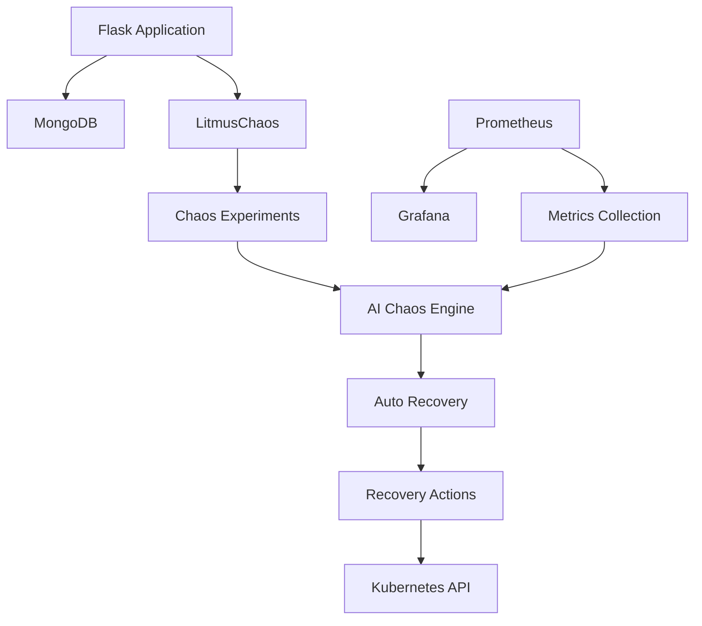
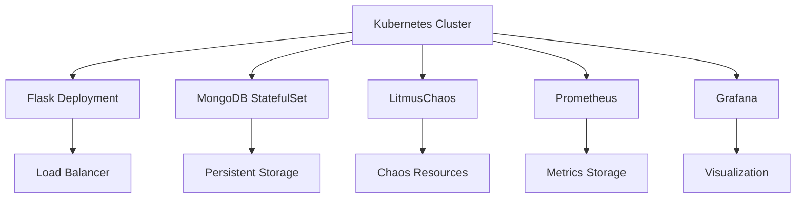

# Architecture Documentation

## System Overview

The Chaos Engineering Platform is a sophisticated system designed to test and improve the resilience of cloud-native applications. It combines traditional chaos engineering practices with AI/ML capabilities for intelligent failure prediction and automated recovery.

## Architecture Diagram

## Components

### 1. Flask Application
- Serves as the main web interface
- Handles user interactions and experiment management
- Communicates with MongoDB for data persistence
- Integrates with LitmusChaos for experiment execution

### 2. MongoDB
- Stores experiment configurations and results
- Maintains system state and metrics history
- Provides data for AI model training
- Ensures data persistence across experiments

### 3. LitmusChaos Integration
- Manages chaos experiments
- Provides experiment templates
- Handles experiment execution and monitoring
- Integrates with Kubernetes for resource manipulation

### 4. AI Chaos Engine
- Predicts potential failure points
- Generates intelligent chaos experiments
- Learns from historical data
- Adapts experiment parameters based on system state

### 5. Auto Recovery System
- Detects system issues
- Executes recovery strategies
- Maintains recovery history
- Analyzes recovery patterns

### 6. Monitoring Stack
- Prometheus for metrics collection
- Grafana for visualization
- Custom dashboards for chaos experiments
- Real-time system monitoring

## Data Flow

1. **Metrics Collection**
   - Prometheus collects system metrics
   - Metrics are stored in MongoDB
   - AI engine processes metrics for predictions

2. **Experiment Generation**
   - AI engine analyzes system state
   - Generates appropriate chaos experiments
   - Configures experiment parameters

3. **Experiment Execution**
   - LitmusChaos executes experiments
   - System behavior is monitored
   - Results are recorded

4. **Recovery Process**
   - Issues are detected
   - Recovery strategies are selected
   - Actions are executed
   - Results are logged

## Security Considerations

1. **Authentication**
   - MongoDB authentication
   - Kubernetes service accounts
   - API access controls

2. **Authorization**
   - Role-based access control
   - Resource limits
   - Network policies

3. **Data Protection**
   - Encrypted secrets
   - Secure communication
   - Data backup

## Performance Optimization

1. **Resource Management**
   - Proper resource limits
   - Efficient scaling
   - Load balancing

2. **Monitoring**
   - Real-time metrics
   - Performance dashboards
   - Alerting system

## Deployment Architecture

## Scaling Considerations

1. **Horizontal Scaling**
   - Multiple Flask application replicas
   - MongoDB replica set
   - Prometheus federation

2. **Vertical Scaling**
   - Resource limits and requests
   - Storage capacity planning
   - Network bandwidth allocation

## Disaster Recovery

1. **Backup Strategy**
   - MongoDB backups
   - Configuration backups
   - State persistence

2. **Recovery Procedures**
   - Automated recovery
   - Manual intervention points
   - Recovery testing

## Future Enhancements

1. **AI/ML Improvements**
   - Enhanced prediction models
   - Automated experiment optimization
   - Pattern recognition

2. **Integration Capabilities**
   - Additional chaos tools
   - CI/CD pipeline integration
   - Custom experiment types

3. **Monitoring Enhancements**
   - Advanced metrics
   - Custom dashboards
   - Predictive analytics 